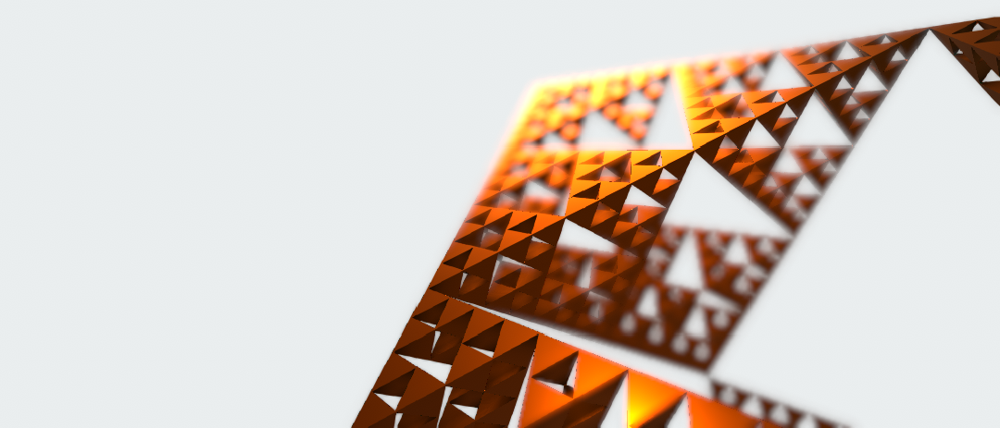
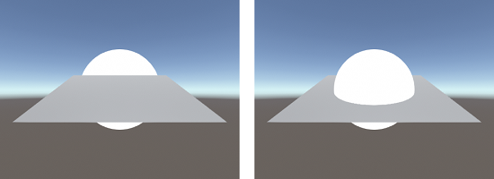
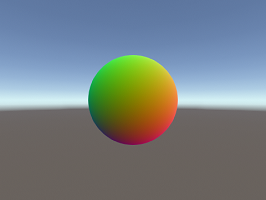
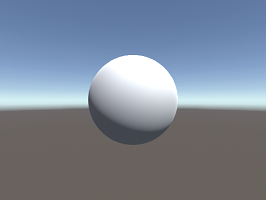
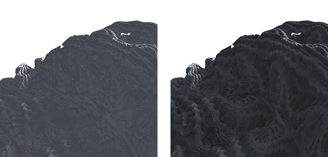
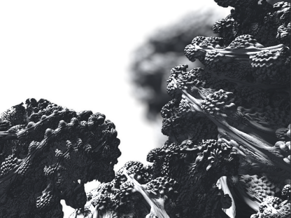

# Unity Ray Marching



## About

This project aims to implement the ray marching algorithm for rendering within Unity by leveraging the existing lighting pipeline of the engine. The goal of this implementation is to enable real-time, photorealistic visualization of implicit surfaces defined by signed distance functions and in particular of 3D fractals, such as the Mandelbulb.

(Link to presentation slides [here](Docs/slides.pdf))

## What is ray marching?

Ray marching is an image based rendering technique similar to ray tracing in that both techniques render images by casting one (or several) rays through a scene to determine the color of each pixel. Unlike ray tracing, which relies on explicitly computing the intersection points of each ray with the scene, ray marching works by sampling an underlying function at multiple points along the ray. For this reason, ray marching is better suited when rendering implicit surfaces or participating media. The exact nature of this underlying function will in turn depend on the nature of the scene in question: Typically this will either be a signed distance function or encode volumetric color data.

One drawback of using the naïve approach to ray marching is that computing the color for each ray can quickly become a very expensive operation, especially in a real-time context. This is because this approach involves taking samples at fixed intervals along the ray, which means that the number of samples grows linearly with the distance traveled by the ray. But more than that, the number of samples is also inversely proportional to the sampling interval: This would entail a performance penalty for every increase in the level of detail of our renderings. Clearly this is not a feasible strategy if we ever hope to achieve accurate depictions of fractals featuring potentially infinitely small surface details!

This is where sphere tracing comes in. Sphere tracing is, in essence, an optimization of the sampling strategy used for ray marching. Specifically, this strategy may be applied whenever we are working with signed distance functions as a representation for some implicit surface. These so-called *signed distance functions* give us the shortest distance to the surface at each point in space. They are positive when outside the surfaces they represent and negative inside, hence "signed." Therefore if our goal is to compute the intersection point between some ray and our scene, we may use this distance estimate as an adaptive sampling interval, iteratively stepping closer and closer to the surface until we reach a point close enough that we may safely assume an intersection has occurred.


*Diagram of the ray marching algorithm*


*Diagram of the sphere tracing algorithm*

## Implementation

### Vertex and fragment shader setup

For our implementation of this algorithm we will be using custom vertex and fragment shaders in Unity. Normally, since the entire scene is rendered via ray marching, rays are cast for every pixel over the entire image. We, on the other hand, will be rendering scenes which mix both mesh-based *and* implicit surfaces. Therefore, for performance reasons, we should avoid performing expensive ray casting operations for parts of the image where it is not necessary. To this end, we will be using polygonal meshes as shells around our implicit surfaces, effectively acting as a conservative estimates for their domain. The first step then will be to use these outer shells as a starting points for generating our rays. This will be the job of the vertex shader:

```glsl
#pragma vertex vert
#pragma fragment frag

#include "UnityCG.cginc"

struct appdata
{
	float4 vertex : POSITION;
};

struct v2f
{
	UNITY_POSITION(pos);
	float3 rayOrigin : TEXCOORD0;
	float3 rayDirection : TEXCOORD1;
};

v2f vert(appdata v)
{
	v2f o;
	o.pos = UnityObjectToClipPos(v.vertex);
	o.rayOrigin = ObjSpaceCameraPos();
	o.rayDirection = v.vertex - o.rayOrigin;
	return o;
}
```

Here we see the vertex shader computes the ray origin and direction for each vertex based on the position of the camera. It is important to note that both of these are in object space coordinates. This information will then be interpolated and passed along to each fragment, all of which will perform their own ray casting and lighting computations in parallel. Thus it  is here where the ray marching loop will be performed:

```glsl
fixed4 frag(v2f i) : SV_Target
{
	float3 rayOrigin = i.rayOrigin;
	float3 rayDirection = normalize(i.rayDirection);
	float3 pos;
	float t = 0.0;
	
	for (int i = 0; i < MAX_STEPS && t < MAX_DISTANCE; ++i) {
		pos = rayOrigin + t * rayDirection;
		float d = SDF(pos);
		if (d < TOLERANCE) {
			break;
		}
		t += d;
	}

	if (t >= MAX_DISTANCE) {
		discard;
	}

	return fixed4(1.0, 0.0, 1.0, 1.0);
}
```

Based on the distance to the scene, the algorithm travels along the ray until it either reaches a point that is close enough to the surface or strays too far, missing the surface entirely. In this case, the fragment is simply discarded. Note that here `SDF` represents the signed distance function to the scene. By this point, we should have enough to render simple primitives.

### Writing to the depth buffer

There is still one thing left to fix, however. By default, the depth value of each fragment is computed by interpolating the depth values of vertices in the mesh. In our case, however, the vertices in our mesh bare no relation to the implicit surface, which is what we are actually rendering. This leads to problems with fragment drawing order such that in scenes featuring multiple objects some may be incorrectly rendered either behind or in front of others. To fix this, we need to set the correct depth value in our fragment shader. This can be done by adding an additional output parameter and by using the computed distance traveled along each ray, as follows:

```glsl
fixed4 frag(v2f i, out float depth : SV_Depth) : SV_Target
{
	// ...
	
	float4 clipPos = UnityObjectToClipPos(pos);
	depth = clipPos.z / clipPos.w;
	
	return fixed4(1.0, 0.0, 1.0, 1.0);
}
```



*Example of depth values before (left) and after (right) correction*

### Normal approximation

At this point we can render ray marched objects into the scene, although with a solid, flat color. All that is missing now is to properly shade those objects given the lighting information of the scene. But before we can do this, we will need to compute the surface normals for our fragments. As a reminder, the normal is a unit vector pointing outwards perpendicular to the surface, and determining its value is a necessity for implementing pretty much any lighting model. In our case, we can derive its value by taking the gradient of the distance function. Here we have a several options, from countless numerical methods to analytic computation. For the sake of generality, we will be taking the numerical approach. Forward differences should be fast yet accurate enough for our use case:

```glsl
float3 Normal(float3 pos)
{
    float3 h = float3(NORMAL_APPROX_STEP, -NORMAL_APPROX_STEP, 0);
    return normalize(float3(
        SDF(p + h.xzz) - SDF(p),
        SDF(p + h.zxz) - SDF(p),
        SDF(p + h.zzx) - SDF(p)
    ));
}
```



*Visualization of normals*



*Results after applying photorealistic shading*

### Ray marched shadows

Next up is shadows. For this effect we can borrow the same strategy as in ray marching by casting a ray in the direction of the light source to check for obstructions. Doing this will grant us very accurate hard shadows, since we'll be performing the calculation per fragment. Note, however, than this is a relatively expensive effect since it requires an additional ray cast per fragment. But there's an upshot: we can leverage the distance estimate given by the signed distance function to approximate soft shadows with relative ease. All we have to do is accumulate the distance to the scene at each step in the marching loop to compute an approximate penumbra factor. This is exactly what the following code does (note the similarities to the previous ray marching loop):

```glsl
float Shadow(float3 pos)
{
    float3 lightDir = ObjSpaceLightDir(float4(pos, 1.0));
    float result = 1.0;
    float t = 0.0;

    for (int i = 0; i < MAX_STEPS && t < MAX_DISTANCE; ++i) {
        float d = SDF(pos + t * lightDir);
        if (d < TOLERANCE) {
            return 0;
        }
        t += d;
        result = min(SOFT_SHADOW_FACTOR * d / t, result);
    }

    return result;
}
```


*Comparison between hard (left) and soft shadows using different factors (center and right)*

### Object space ambient occlusion

Another effect that the signed distance functions enables us to achieve is ambient occlusion. By sampling the distance to the scene a few times along the direction of the surface normal, it is possible to approximate an ambient occlusion factor for each fragment in our image. Since these samples are taken independently of the camera position, we get an object space effect that is less susceptible to artifacts due to awkward view directions when compared to screen space ambient occlusion. Because the number of samples required for a convincing result is typically low, this is a relatively cheap effect to implement. Below is our implementation of this effect:

```glsl
float AmbientOcclusion(float3 pos, float3 normal)
{
    float acc = 0.0;
    
    for (int i = 1; i <= AMBIENT_OCCLUSION_SAMPLES; ++i) {
        float d = SDF(pos + i * AMBIENT_OCCLUSION_STEP * normal);
        acc += exp2(-i) * (i * AMBIENT_OCCLUSION_STEP - max(d, 0.0));
    }
    
    return min(1.0 - AMBIENT_OCCLUSION_MULTIPLIER * acc, 1.0);
}
```



*Mandelbulb detail with (right) and without (left) ambient occlusion*

### The Mandelbulb

Lastly we come to the subject of distance estimated 3D fractals. There exists a broad variety of 3D fractals we could choose to implement, but here we will be focusing on the Mandelbulb. The Mandelbulb is a fractal based on the famous Mandelbrot set and can be though of as a generalization of the Mandelbrot set from 2D into 3D. Where the Mandelbrot is based on the convergence properties of functions over the complex plane, the Mandelbulb relies on extending the properties of number in the complex plane into 3D. This is done by replicating the geometric properties of the multiplication of complex numbers, i.e. magnitudes are multiplied and angles are added together in polar coordinates. This yields a fractal that is visually very reminiscent of the Mandelbrot set, as can be seen below:



*The Mandelbulb*


*Iterative formula describing the Mandelbulb*

Of course, our renderer cannot use the formula for the Mandelbulb as stated above since it is not a signed distance function. To solve this problem, we need to use a distance estimator. A distance estimator is an approximation of a signed distance function, which if accurate enough may be used for rendering purposes. The derivation of such distance estimators is an ongoing field of research, especially if we are concerned with high degrees of accuracy. Good approximations exists for the Mandelbrot set, so we will be using a estimator based on those for the Mandelbulb as well. They essentially work by looking at how fast these iterative functions either converge or diverge, that is, by looking at the rate by which the magnitudes of these values either decrease or increase. From the iterative formula it is possible to arrive at a derivative for this magnitude, often called a "running derivative" since it can be computed along with the result of the iterative formula. It is important to note, however, that the distance estimate we get from this running derivative is merely an estimate. As such it is susceptible to inaccuracies, especially when taken far away from the surface, which may lead to overstepping during the ray marching loop and incorrect results when rendering. To solve this problem it is often enough to use a different primitive as an approximation for the fractal when the ray is far away and then switch to the distance estimator when close enough. We will be doing this by encapsulating our Mandelbulb with a sphere that is large enough to avoid any numerical problems. What follows is the entire signed distance estimator for the Mandelbulb, including this sphere approximation for distant samples:

```glsl
float SDF(float3 pos)
{
    if (length(pos) > 1.0) {
        return length(pos) - 0.5;
    }
    
    float3 z = pos;
    float dr = 1.0;
    float r = 0.0;
    
    for (int i = 0; i < ITERATIONS; ++i) {
        // Convert to polar coordinates
        r = length(z);
        if (r > ESCAPE_RADIUS) {
            break;
        }
        float theta = acos(z.y/r);
        float phi = atan2(z.z,z.x);
        dr = pow(r, POWER - 1.0) * POWER * dr + 1.0;
        
        // Scale and rotate the point
        float zr = pow(r, POWER);
        theta = theta * POWER;
        phi = phi * POWER;
        
        // Convert back to cartesian coordinates
        z = zr * float3(sin(theta)*cos(phi), cos(theta), sin(phi)*sin(theta));
        z += pos;
    }
    
    return 0.5 * log(r) * r / dr;
}
```

## Controls

* Move: `W`, `A`, `S`, `D`
* Look: `Mouse X/Y`
* Rotate: `Q`, `E`
* Ascend/descend: `LShift`, `Space`

## Requirements

* Unity 2019.3.5f1
* Shader Model 2.0 compatible GPU
